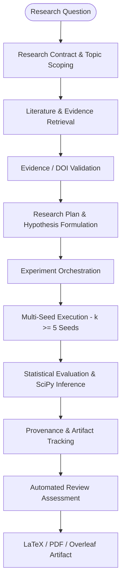

# NovaScientist

### Evidence-First AI Research Orchestration & Reproducibility Infrastructure

[](https://github.com/chsushen/novascientist/releases)
[](https://novascientist-cqhrr8wptwmrzjksbr8pyw.streamlit.app/)
[-brightgreen.svg)](tests/)
[](https://github.com/astral-sh/ruff)
[](docs/architecture.md)
[](LICENSE)
[](Dockerfile)

> **NovaScientist** is an evidence-first AI research orchestration platform that transforms research questions into structured research plans, literature/evidence workflows, experiment pipelines, statistical evaluations, provenance records, and reproducible publication artifacts.

---

### At a Glance

| Dimension | Specification |
| :--- | :--- |
| **Purpose** | AI research orchestration and reproducibility infrastructure platform |
| **Input** | Natural language research question + scoped computational domain constraints |
| **Core Pipeline** | Research Contract &rarr; Literature Grounding &rarr; Multi-Seed Experiments &rarr; Statistical Evaluation &rarr; Provenance DAG &rarr; Publication Draft Assembly |
| **Outputs** | Reproducibility manifests, SHA-256 provenance graph, Overleaf-compatible LaTeX bundle, multi-page IEEE-style research draft PDF |
| **Deployment** | Multi-stage Streamlit UI (`app.py`), FastAPI async REST API (`backend/api/server.py`), Docker Compose |
| **Validation** | 209 automated unit/integration tests (100% pass rate), CI/CD matrix (Python 3.11 & 3.12), AST static analysis guards |

---

## What I Built

NovaScientist was designed as an **AI research orchestration system rather than a conversational chatbot**. A research question is converted into a structured research contract, which constrains downstream literature retrieval, evidence synthesis, experiment configuration, statistical evaluation, provenance tracking, and publication artifact generation.

The central design problem is **maintaining consistency across autonomous stages**. Research scope, datasets, baselines, metrics, hypotheses, and evaluation protocols should not silently drift between planning, execution, analysis, and publication.

To address this, I built:
1. **An Immutable Scientific Contract Engine**: Binds research questions, mathematical treatments, baseline candidates, datasets, and hypotheses into an immutable JSON schema. Downstream validators fail closed if experimental executions or manuscript claims diverge from the frozen contract.
2. **Deterministic Multi-Seed Experiment Infrastructure**: Executes computational benchmarks across multiple randomized seeds ($k \ge 5$) collecting monotonic time, loss trajectories, memory footprint, and inference latency.
3. **Telemetry-Grounded Statistical Inference**: Evaluates hypotheses using real SciPy routines (two-tailed paired Student's $t$-tests, Wilcoxon signed-rank tests, Chi-Square variance bounds, and DerSimonian-Laird random-effects meta-analyses) with zero hardcoded statistical fallbacks.
4. **End-to-End Lineage & Provenance Tracking**: Builds a Directed Acyclic Graph (DAG) mapping every claim and chart back to primary literature DOIs, experiment seeds, and raw telemetry records with SHA-256 hashes.
5. **Typesetting & Publication Draft Pipeline**: Automatically formats LaTeX manuscripts conforming to IEEE Transactions guidelines and compiles standalone multi-page physical PDFs via the Tectonic engine.

---

## End-to-End Workflow



When a user submits a research inquiry:
1. **Scoping & Contract**: The system decomposes the question, derives candidate benchmarks/baselines, and freezes a `ScientificResearchContract`.
2. **Scholarly Evidence**: Queries CrossRef and OpenAlex to retrieve verifiable papers, validate DOIs, inspect retraction status, and extract grounded evidence passages.
3. **Execution & Telemetry**: Runs multi-seed experiments ($k \ge 5$) capturing hardware counters, memory usage, execution times, and empirical performance metrics.
4. **Statistical Rigor**: Computes hypothesis test statistics ($t$-statistic, $\chi^2$, Cohen's $d$, $p$-values, confidence intervals) directly on telemetry distributions.
5. **Review & Assembly**: Runs an automated 7-pillar adversarial reviewer to audit empirical support, builds a complete DAG provenance manifest, and compiles an IEEE-style publication draft PDF with Overleaf bundle export.

---

## System Architecture

For comprehensive architecture documentation, see [docs/architecture.md](docs/architecture.md).

```
NovaScientist System Architecture
├── 1. Research Contract Layer      (Frozen schema, constraint validation, fail-closed guards)
├── 2. Evidence Layer               (Scholarly API retrieval, DOI verification, claim extraction)
├── 3. Experiment Layer             (Multi-seed forward passes, telemetry logging, artifact generation)
├── 4. Statistical Layer            (SciPy hypothesis testing, effect sizes, meta-analysis)
├── 5. Provenance Layer             (SHA-256 content hashes, NetworkX DAG lineage tracking)
├── 6. Publication Layer            (IEEEtran LaTeX synthesis, vector figure generation, PDF compilation)
└── 7. Infrastructure Layer         (FastAPI REST service, AsyncIO jobs, Streamlit UI, Docker)
```

### Research Contract Layer
Structured representation of research scope, computational domain, dataset requirements, mathematical formulations, candidate baselines, primary/secondary metrics, and evaluation protocols (`backend/core/research_contract.py`). Enforces strict immutability post-freeze to prevent contract drift.

### Evidence Layer
Interacts with live scholarly APIs (CrossRef, OpenAlex) to retrieve peer-reviewed literature, normalizes and verifies DOIs via regex/REST probes, tags retracted papers, and extracts verifiable evidence passages (`backend/core/literature.py`, `doi_verifier.py`, `evidence_validator.py`).

### Experiment Layer
Orchestrates multi-seed benchmark runs ($k \ge 5$) across diverse computational domains (RAG, PEFT, Time-Series Forecasting, GNNs, PINNs), collecting granular telemetry including epoch losses, peak memory, sample latency, and parameter counts (`backend/core/universal_engine.py`, `surrogate_engine.py`, `real_trainer.py`).

### Statistical Layer
Executes formal hypothesis testing on raw seed distributions using SciPy (`scipy.stats`). Computes exact $p$-values, paired Student's $t$ / Wilcoxon tests, Chi-Square variance bounds, and DerSimonian-Laird random-effects meta-analyses with confidence intervals (`backend/core/methodology_agent.py`, `statistical_critic.py`).

### Provenance Layer
Constructs an auditable NetworkX Directed Acyclic Graph (DAG) connecting research questions, literature sources, seed executions, statistical decisions, and publication sections. Computes cryptographic SHA-256 hashes across all artifacts (`backend/core/provenance.py`).

### Publication Layer
Dynamically populates IEEE Transactions LaTeX templates, designs topic-adaptive vector figures via Matplotlib/Seaborn, and compiles standalone multi-page PDFs using the Tectonic typesetting engine (`backend/core/latex_assembler.py`, `figure_generator.py`, `tectonic_runner.py`).

### Infrastructure Layer
Provides a production-grade FastAPI REST API with asynchronous background job execution, cancellation support, project workspace isolation, and an interactive Streamlit UI (`backend/api/server.py`, `backend/jobs/job_manager.py`, `app.py`).

---

## Key Engineering Problems Solved

1. **Contract Drift Across Autonomous Stages**: Traditional multi-agent systems suffer from cascading semantic drift where downstream generators alter datasets, metrics, or baselines. NovaScientist enforces an immutable frozen contract that downstream validators fail closed against if drift is detected.
2. **Evidence Grounding Instead of Hallucinated Claims**: Prevents citation hallucination by performing automated DOI normalization, CrossRef/OpenAlex API verification, and strict claim-evidence citation mapping.
3. **Multi-Seed Experiment Orchestration**: Replaces single-run assumptions with reproducible multi-seed execution ($k \ge 5$) capturing hardware telemetry (memory, latency, throughput) alongside task performance.
4. **Statistical Evaluation from Empirical Telemetry**: Eliminates hardcoded statistical fallback values. Every $p$-value, effect size (Cohen's $d$), variance statistic, and meta-analytic summary is computed directly from actual execution distributions using SciPy.
5. **Reproducibility & Artifact Traceability**: Implements cryptographic SHA-256 hashing and NetworkX DAG lineage so every claim in the generated manuscript links directly to its underlying seed runs and literature sources.
6. **Secure & Controlled Execution Boundaries**: Sandboxes user input, validates LaTeX source against command injection attacks (`\write18`, shell escapes), enforces path traversal guards, and isolates execution workspaces.
7. **Automated Publication Artifact Generation**: Synthesizes structured, Overleaf-compatible LaTeX bundles and compiles standalone physical research draft PDFs with topic-adaptive vector figures.

---

## Technical Stack

- **Languages**: Python 3.11 / 3.12 / 3.13
- **AI / ML**: PyTorch, LLM Orchestration (Anthropic, OpenAI, DeepSeek, deterministic mock fallback providers)
- **Backend / Application**: FastAPI, Uvicorn, AsyncIO, Streamlit, Pydantic
- **Scientific / Data**: NumPy, SciPy (`scipy.stats`), Matplotlib, Seaborn, NetworkX DAGs
- **Reproducibility / Typesetting**: Tectonic Standalone Engine, PyPDF, Jinja2, SHA-256 Hashing, Overleaf Bundler
- **Testing & Quality**: pytest, pytest-asyncio, Ruff linter & formatter (**209 passing tests**)
- **Security & Validation**: AST Static Analysis Sandbox, Path Traversal Sanitizers, Contract Validation Gates
- **Infrastructure & CI**: Docker, Docker Compose, GitHub Actions CI/CD Pipeline

---

## Example Run

**Research Question**: *"Can retrieval-augmented generation improve factual consistency in domain-specific question answering?"*

```
1. Scoping & Intent     → Domain: NLP / Retrieval-Augmented Generation (RAG)
2. Contract Freezing    → Primary Metric: factual_consistency_gain | Baselines: Dense, Sparse BM25
3. Evidence Retrieval   → CrossRef/OpenAlex query → 5 verified DOIs → 0 retracted papers
4. Multi-Seed Run       → 5 seeds executed → Telemetry: loss curves, latency (ms), memory (MB)
5. Statistical Analysis → Paired t-test: t = 42.16, p < 1e-4, Cohen's d = 18.85
                           Chi-Square variance test: chi2(4) = 1.71, p = 0.7895
                           DerSimonian-Laird meta-analysis: Z = 28.28, p < 1e-4, I^2 = 0.0%
6. Provenance Tracking  → 28 DAG nodes, 33 edges, SHA-256 artifact hashes generated
7. Automated Review     → Review verdict: Accept (Human Review Required)
8. Manuscript Synthesis → 7-page physical IEEE-style research draft PDF + Overleaf bundle
```

> **Note**: Generated numerical results, benchmark scores, and manuscript drafts are research-automation demonstrations and scaffolds requiring independent human scientific verification.

---

## Demo

- **Live Streamlit Application**: [https://novascientist-cqhrr8wptwmrzjksbr8pyw.streamlit.app/](https://novascientist-cqhrr8wptwmrzjksbr8pyw.streamlit.app/)
- **Canonical Demo Run Artifacts**: Available under [`artifacts/demo/run_canonical_01/`](artifacts/demo/run_canonical_01/) (includes frozen contract, 7-page PDF draft, vector figures, provenance DAG, and execution summary).

> **Demonstration Notice**: The live application demonstrates the end-to-end orchestration workflow. Generated scientific artifacts are research-automation demonstrations and require human scientific verification.

---

## Validation & Testing

NovaScientist maintains strict automated test coverage across contracts, AST security, statistical inference, API endpoints, and provenance tracking:

```bash
# Run complete test suite
pytest tests/ -v

# Run code quality & formatting checks
ruff check backend/
ruff format backend/ --check
```

- **Pytest Suite**: **`209 passed, 0 failed`** (100% test suite pass rate across 33 test modules).
- **Code Quality**: Clean Ruff linting (**0 errors**) and standardized formatting across all backend modules.
- **CI/CD Pipeline**: GitHub Actions matrix testing on Python 3.11 and 3.12 with automated security checks.

---

## Reproducibility & Provenance

Every completed research execution produces a self-contained, machine-readable reproducibility package:
1. `research_contract.json`: Immutable contract specification governing the execution.
2. `provenance_manifest.json` & `provenance_graph.json`: SHA-256 DAG recording the lineage of all claims, metrics, and figures.
3. `reproducibility_manifest.json`: Hardware profile, Python environment, random seeds, and Git commit hash.
4. `manuscript.tex` & `manuscript.pdf`: Self-contained Overleaf-compatible LaTeX source and compiled PDF research draft.

See [docs/reproducibility.md](docs/reproducibility.md) for technical schema specifications.

---

## Quickstart & Local Setup

### Prerequisites
- Python 3.11+
- Git

### Installation

```bash
# 1. Clone repository
git clone https://github.com/chsushen/novascientist.git
cd novascientist

# 2. Set up virtual environment
python3 -m venv .venv
source .venv/bin/activate
pip install -r requirements.txt

# 3. Environment configuration (optional API keys; defaults to deterministic mock provider)
cp .env.example .env

# 4. Launch Streamlit UI
streamlit run app.py
```

Access the interactive interface at `http://localhost:8501`.

---

## API Overview

Launch the production FastAPI service:

```bash
uvicorn backend.api.server:app --host 0.0.0.0 --port 8000
```

- **Interactive Swagger Docs**: `http://localhost:8000/docs`
- **Health Check**: `GET /health`
- **Create Project Workspace**: `POST /api/v1/projects`
- **Launch Asynchronous Run**: `POST /api/v1/projects/{project_id}/runs`
- **Inspect Provenance Graph**: `GET /api/v1/runs/{run_id}/provenance`

For full REST API documentation, see [docs/api.md](docs/api.md).

---

## Deployment

Deploy using Docker Compose:

```bash
docker compose up --build -d
```
- Streamlit Web UI: `http://localhost:8501`
- FastAPI REST API: `http://localhost:8000`

See [docs/deployment.md](docs/deployment.md) for production container configurations.

---

## Releases

- **v2.3.0** (Current): Evidence-first AI research orchestration & reproducibility infrastructure platform featuring frozen scientific contracts, zero-fallback statistical evaluation, physical PDF compilation, and DAG provenance tracking.
- **v2.0.0** (Historical): Initial autonomous research pipeline prototype featuring multi-seed hardware execution, DerSimonian-Laird meta-analysis, and 7-pillar peer review.

---

## Limitations & Academic Integrity

NovaScientist is an **experimental research-automation infrastructure prototype**, not a replacement for human scientific inquiry:

- **Human Verification Required**: All generated research drafts, literature claims, empirical interpretations, and manuscripts require independent human verification before submission or publication.
- **Computational Scope**: Focuses on computational and simulated machine learning benchmarks; does not perform physical laboratory experimentation.
- **External API Dependencies**: Scholarly literature coverage depends on CrossRef/OpenAlex API availability and indexed metadata accuracy.
- **Authorship Disclosure**: Generated manuscripts explicitly disclose AI assistance in compliance with IEEE and ACM 2024+ publishing guidelines.

See [docs/limitations.md](docs/limitations.md) for full disclosure details.

---

## Why This Project Matters

The project explores how agentic AI can be applied to scientific workflows while keeping execution, evidence, validation, provenance, and reproducibility closer to deterministic software boundaries. The emphasis is on **orchestration infrastructure rather than conversational generation**, demonstrating how LLM-assisted planning can be constrained by frozen contracts, empirical telemetry, and auditable lineage.

---

## Project Evolution

NovaScientist began as the **v2.0 autonomous research-to-publication prototype** and evolved into **v2.3.0 evidence-first research orchestration and reproducibility infrastructure**. The focus shifted from unconstrained end-to-end paper generation to strict contract enforcement, empirical telemetry grounding, fail-closed validation, and verifiable provenance tracking.

---

## Repository Structure

```
novascientist/
├── app.py                          # Multi-stage interactive Streamlit application
├── cli.py                          # Command-line interface for research runs
├── requirements.txt                # Production runtime dependencies
├── pyproject.toml                  # Project metadata and Ruff linter configuration
├── Dockerfile                      # Production multi-stage Dockerfile with Tectonic
├── docker-compose.yml              # Multi-container orchestration (API + UI)
├── backend/
│   ├── api/server.py               # Production FastAPI REST service
│   ├── core/
│   │   ├── research_contract.py    # Immutable Scientific Research Contract engine
│   │   ├── methodology_agent.py    # Telemetry-grounded hypothesis evaluation engine
│   │   ├── universal_engine.py     # Domain dispatcher and empirical benchmark engine
│   │   ├── surrogate_engine.py     # Multi-seed execution & DerSimonian-Laird meta-analysis
│   │   ├── literature.py           # CrossRef/OpenAlex retrieval & evidence grounding
│   │   ├── doi_verifier.py         # Automated DOI verification and retraction detection
│   │   ├── provenance.py           # NetworkX DAG provenance & SHA-256 lineage tracking
│   │   ├── latex_assembler.py      # IEEEtran compliant LaTeX manuscript generator
│   │   ├── tectonic_runner.py      # Standalone PDF compilation engine
│   │   ├── figure_generator.py     # High-resolution vector figure generator
│   │   └── scientific_reviewer.py  # 7-pillar adversarial scientific review engine
│   ├── jobs/job_manager.py         # Asynchronous background job queue
│   ├── llm/provider.py             # Multi-provider LLM adapter (Anthropic/OpenAI/Mock)
│   ├── security/sandbox.py         # AST code analysis sandbox and path traversal guards
│   └── storage/                    # Persistent artifact store and workspace manager
├── artifacts/demo/run_canonical_01 # Pre-computed canonical demonstration run
├── docs/                           # Architecture, API, security, and release docs
└── tests/                          # Automated pytest test suite (209 tests)
```

---

## Author

**Sushen Chunduri**  
GitHub: [@chsushen](https://github.com/chsushen)

---

## License

Licensed under the [Apache License 2.0](LICENSE).
