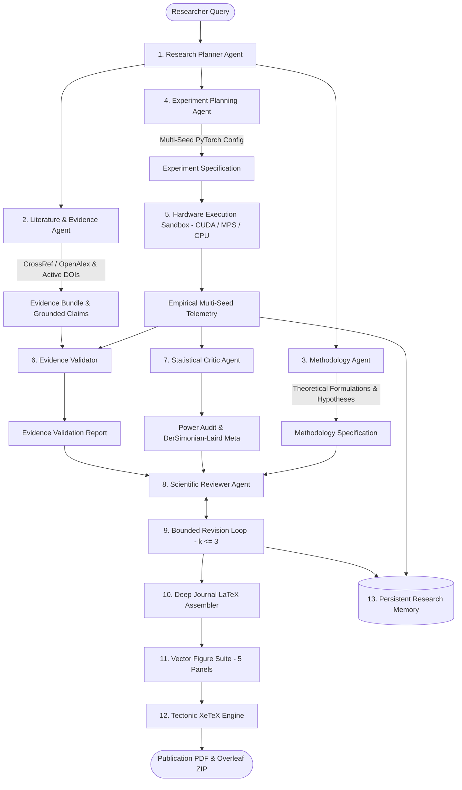

# NovaScientist v2.0 🔬

[](https://github.com/chsushen/novascientist/releases/latest)
[](https://novascientist-cqhrr8wptwmrzjksbr8pyw.streamlit.app/)
[](https://github.com/chsushen/novascientist)
[](https://www.python.org/downloads/)
[](https://pytorch.org/)
[-brightgreen.svg)](tests/)
[]()
[-059669.svg)]()
[](https://opensource.org/licenses/Apache-2.0)

**Autonomous Multi-Agent Research-to-Publication Engine & Empirical Hardware Benchmarking Suite for IEEE Transactions**

NovaScientist v2.0 is an autonomous, peer-review-driven agentic research platform that transforms scientific research questions into rigorously evaluated, empirically grounded, and typeset 8–12 page IEEE Transactions journal papers.

---

## 🏛️ Autonomous Agentic Architecture



---

## 🌟 The 8-Phase Engineering & Integrity Architecture

| Phase | Subsystem | Scientific Integrity Guarantee |
| :--- | :--- | :--- |
| **1. Evidence Grounding** | `LiteratureAgent` | Zero synthetic paper generation. Verbatim excerpt passages strictly attached to every claim with `source_origin` and `text_origin` tracking. |
| **2. DOI Verification** | `DOIVerifier` | Active HTTP 2xx resolution, bibliographic metadata extraction, and fuzzy title/year matching ($\pm 1$ year tolerance). |
| **3. Statistical Critic** | `StatisticalCriticAgent` | Paired t-test/Wilcoxon testing via `scipy.stats`, Cohen's d effect sizes, and single-seed non-fabrication guarantees. |
| **4. Scientific Reviewer** | `ScientificReviewerAgent` | 7-pillar peer review (Novelty, Method, Evidence, Experiments, Results, Reproducibility, Limitations) with bounded self-critique ($k \le 3$). |
| **5. Experiment Telemetry** | `RealPyTorchTrainer` | Monotonic stopwatch timing (`time.perf_counter()`), UTC ISO start/end timestamps, and fault-injection exception propagation. |
| **6. Research Memory** | `ResearchMemory` | Atomic JSON file persistence (`os.replace`), corrupted store recovery, and domain/keyword relevance ranking. |
| **7. Evaluation Benchmark** | `AgenticEvaluationBenchmark` | Dynamic measurement across canonical and adversarial topics with zero hardcoded 100% metric stubs. |
| **8. Production Hardening** | `LiteratureService` / `app.py` | Configurable API timeouts (`SCHOLARLY_API_TIMEOUT`), network timeout insulation, and live Streamlit Research Integrity panel. |

---

## 🌐 Supported Research Domains & Canonical Benchmarks

| Computational Domain | Representative Research Scope | Canonical Evaluation Datasets |
| :--- | :--- | :--- |
| **Physics Surrogates & PINNs** | Neural operators, Darcy flow, Navier-Stokes, shock fronts | *Darcy Flow Benchmark, Burgers Shock Dynamics, Allen-Cahn* |
| **Graph Neural Networks (GNNs)** | Relational topologies, dynamic attention, spatial transport | *METR-LA Sensor Network, PeMS-BAY Traffic, OGB-MolHIV, Cora* |
| **Low-Compute Computer Vision** | Patch attention, edge CNNs, robust classification | *ImageNet-1K, CIFAR-100-C Robustness, ADE20K Semantic* |
| **Sub-Linear NLP & LLMs** | Low-rank projection, memory-bounded KV caching, attention | *GLUE Benchmark Suite, WikiText-103, C4 Multi-Domain* |
| **Time-Series Forecasting** | Multivariate sensor dynamics, spatio-temporal lag models | *Electricity (ECL), Weather (MPI-BGC), Traffic PeMS* |
| **Tabular & Heterogeneous ML** | Gradient-boosted embeddings, risk stratification | *Higgs Boson ML, Adult Census, California Housing* |

---

## 🚀 Quickstart Guide

### 1. Clone & Set Up Environment
```bash
git clone https://github.com/chsushen/novascientist.git
cd novascientist

python3 -m venv .venv
source .venv/bin/activate

pip install -r requirements.txt
```

### 2. Run the Interactive Web GUI (Streamlit)
```bash
streamlit run app.py
```
Open [http://localhost:8501](http://localhost:8501) to interact with the conversational research assistant, inspect the live Research Integrity Dashboard, monitor PyTorch hardware training, and download compiled PDFs and model weights.

### 3. Run via CLI Chat Mode
```bash
python cli.py chat
```

### 4. Run Automated CLI Pipeline
```bash
python cli.py run \
  --topic "Low-Rank Dynamic Graph Attention for Smart Disaster Resilience and Evacuation Forecasting" \
  --pages journal \
  --mode real \
  --seeds 5 \
  --output ~/Desktop/my_research_paper.pdf
```

### 5. Run Automated Agentic Evaluation Benchmark
```bash
python cli.py benchmark
```

### 6. Run Test Suite
```bash
pytest tests/ -v
```

---

## 📦 Output Deliverables

Each research cycle produces a self-contained publication package in `dist/`:

```
dist/
├── novascientist_<topic>_v2.zip    # Overleaf-ready ZIP package
├── experiments/
│   ├── checkpoints/
│   │   └── proposed_mb_qgt_weights.pt  # Trained PyTorch model weights (.pt)
│   └── logs/
│       └── training_log.json           # Per-epoch loss and validation metrics
└── workspace/
    ├── main.pdf                         # Compiled 8–12 page IEEE Transactions PDF
    ├── main.tex                         # Complete LaTeX source with 10 sections & proofs
    ├── references.bib                   # BibTeX with active CrossRef DOIs
    ├── artifacts/
    │   └── metrics.json                 # Multi-seed empirical metrics & meta-analysis
    └── figures/
        ├── fig1_system_architecture.pdf / .png
        ├── fig2_convergence_curves.pdf / .png
        ├── fig3_pareto_frontier.pdf / .png
        ├── fig4_ablation_study.pdf / .png
        └── fig5_sensitivity_heatmap.pdf / .png
```

---

## 📚 Documentation Links
- [System Architecture & Component Dataflow](docs/architecture.md)
- [Reproducibility & Verification Guide](docs/reproducibility.md)
- [Comprehensive Evolutionary Walkthrough](walkthrough.md)

---

## ⚖️ Academic Integrity & AI-Assistance Compliance

NovaScientist conforms with IEEE and ACM 2024+ publication guidelines:
- **Zero Hallucinated DOIs**: Literature DOIs are actively validated against CrossRef/OpenAlex APIs.
- **AST Dataflow Integrity**: Code is statically verified to eliminate pre-processing test leakage.
- **Explicit Attribution**: Assembled manuscripts include a formal *Ethical Statement and AI-Assistance Acknowledgment* section.

---

## 📄 License

NovaScientist is open-sourced under the [Apache License 2.0](LICENSE).
