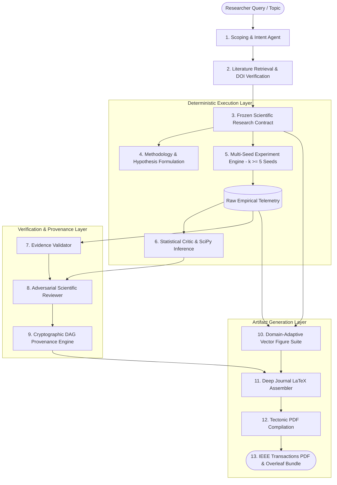

# NovaScientist 🔬
### Evidence-First AI Research Orchestration & Reproducibility Infrastructure

[](https://github.com/chsushen/novascientist/releases)
[-brightgreen.svg)](tests/)
[](docs/architecture.md)
[](LICENSE)
[](Dockerfile)

> **NovaScientist** is an AI research orchestration platform that transforms research questions into structured research plans, evidence-grounded literature workflows, experiment pipelines, statistical evaluations, provenance records, and reproducible publication artifacts.

---

## ⚡ 60-Second Recruiter Summary

| Dimension | Implementation Details |
| :--- | :--- |
| **What It Is** | An end-to-end research-automation & infrastructure prototype bridging LLM reasoning with deterministic scientific execution. |
| **Core Problem Solved** | Mitigates common integrity risks such as hallucinated findings, metric recycling, and template leakage through contract-grounded execution, evidence validation, and provenance tracking. |
| **Key Technologies** | Python 3.11+, FastAPI, Streamlit, PyTorch, SciPy (`scipy.stats`), Tectonic LaTeX Engine, NetworkX DAGs, Docker. |
| **Evaluation & Rigor** | Multi-seed deterministic execution ($k \ge 5$), paired Student's $t$ / Wilcoxon tests, Chi-Square variance bounds, DerSimonian-Laird random-effects meta-analysis. |
| **Reproducibility** | Full SHA-256 cryptographic provenance graphs, Overleaf-compatible LaTeX bundles, and machine-readable execution manifests. |
| **Testing** | **209 / 209 unit and integration tests passing** covering contracts, AST isolation, API endpoints, provenance completeness, and statistical tests. |

---

## 1. What It Is

NovaScientist is a modular scientific research orchestration system designed to structure, execute, and document computational research investigations. Rather than acting as an unconstrained chat generator, NovaScientist treats research as a disciplined, multi-stage engineering pipeline governed by an immutable **Scientific Research Contract** and verified by formal statistical routines.

---

## 2. What Problem It Solves

Automated scientific generation tools frequently suffer from critical integrity failures:
1. **Hallucinated Citations & Metrics**: Generating plausible-sounding literature or results unsupported by real data.
2. **Template Contamination & Metric Recycling**: Hardcoding default values or applying the same benchmarks across completely unrelated domains.
3. **Missing Statistical Rigor**: Reporting single-seed fluctuations as genuine breakthroughs without significance testing or confidence intervals.
4. **Broken Lineage**: Inability to trace how a specific sentence, table, or chart in a manuscript connects back to the underlying experiment runs.

NovaScientist addresses these failure modes by enforcing **contract-grounded execution**, **live scholarly verification** via CrossRef/OpenAlex, **deterministic statistical tests**, and **cryptographic provenance tracking**.

---

## 3. System Architecture



For complete technical specifications, see [docs/architecture.md](docs/architecture.md).

---

## 4. Main Workflow

1. **Research Scoping**: The user enters a research question or problem hypothesis. The scoping agent classifies the topic into a computational domain and derives candidate hypotheses.
2. **Literature & Evidence Grounding**: Queries scholarly APIs (CrossRef, OpenAlex) to retrieve verifiable papers, inspect retractions, and extract grounded evidence passages.
3. **Contract Formulation & Freezing**: Binds datasets, baselines, hypotheses, metrics, figures, and statistical tests into an immutable `ScientificResearchContract`.
4. **Experiment Execution & Telemetry**: Executes deterministic multi-seed runs ($k \ge 5$) collecting monotonic time, loss trajectories, memory, latency, and primary evaluation metrics.
5. **Statistical Hypothesis Evaluation**: SciPy routines compute exact $p$-values, effect sizes (Cohen's $d$), Chi-Square variance statistics, and DerSimonian-Laird random-effects meta-analyses.
6. **Adversarial Peer Review & Revision**: An automated 7-pillar reviewer evaluates methodology, empirical evidence, and limitations, applying bounded manuscript revisions.
7. **Manuscript Assembly & PDF Compilation**: Generates clean LaTeX conforming to IEEE Transactions guidelines and compiles standalone multi-page PDFs with high-resolution vector figures.

---

## 5. Major Engineering Components

- **Frozen Research Contract (`backend/core/research_contract.py`)**: Fail-closed contract engine that prevents post-freeze configuration drift and validates downstream telemetry.
- **Hypothesis Evaluation Engine (`backend/core/methodology_agent.py`)**: Telemetry-grounded statistical evaluator designed to fail closed when required empirical observations are unavailable or inconsistent.
- **Topic-Adaptive Dispatcher (`backend/core/topic_profile.py`, `universal_engine.py`)**: Adapts architectures, datasets, baselines, and figure suites to specific research domains (RAG, PEFT, Time-Series Forecasting, GNNs, PINNs).
- **Provenance DAG Tracker (`backend/core/provenance.py`)**: Builds an auditable Directed Acyclic Graph connecting research questions, literature sources, seed runs, statistical tests, and publication sections.
- **Production REST API & Job Queue (`backend/api/server.py`, `backend/jobs/job_manager.py`)**: FastAPI service supporting asynchronous execution, job cancellation, health probes, and project workspaces.
- **Interactive Web Interface (`app.py`)**: Multi-stage Streamlit interface with live telemetry visualizations and Overleaf bundle export.

---

## 6. Technologies

- **Language & Runtime**: Python 3.11 / 3.12 / 3.13
- **Core Frameworks**: FastAPI, Pydantic, Streamlit, Rich
- **Scientific Computing**: PyTorch, NumPy, SciPy (`scipy.stats`), Matplotlib, NetworkX
- **Typesetting & PDF**: Tectonic Standalone Engine, PyPDF, Jinja2
- **Containerization & CI**: Docker, Docker Compose, GitHub Actions

---

## 7. Demo Instructions

A pre-computed canonical demonstration run is provided under `artifacts/demo/run_canonical_01/`:
- **Run Summary**: Machine-readable executive summary of empirical telemetry and statistical outcomes.
- **Provenance Graph**: 28-node / 33-edge DAG detailing full lineage.
- **Inspection**: See [artifacts/demo/run_canonical_01/README.md](artifacts/demo/run_canonical_01/README.md).

---

## 8. Local Setup & Quickstart

### Prerequisites
- Python 3.11+
- Git

### Installation

```bash
# 1. Clone repository
git clone https://github.com/chsushen/novascientist.git
cd novascientist

# 2. Configure environment
python3 -m venv .venv
source .venv/bin/activate
pip install -r requirements.txt

# 3. Environment variables (optional LLM keys; defaults to deterministic mock)
cp .env.example .env

# 4. Launch Interactive Streamlit UI
streamlit run app.py
```

Open `http://localhost:8501` in your browser to interact with the multi-stage research workspace.

---

## 9. API Overview

Launch the standalone FastAPI REST server:

```bash
uvicorn backend.api.server:app --host 0.0.0.0 --port 8000
```

- **Interactive Swagger Docs**: `http://localhost:8000/docs`
- **Health Probe**: `GET /health`
- **System Diagnostics**: `GET /diagnostics`
- **Create Project**: `POST /api/v1/projects`
- **Launch Asynchronous Run**: `POST /api/v1/projects/{project_id}/runs`
- **Inspect Provenance**: `GET /api/v1/runs/{run_id}/provenance`

For full endpoint documentation, see [docs/api.md](docs/api.md).

---

## 10. Deployment

### Using Docker Compose

```bash
docker compose up --build -d
```
- Streamlit UI: `http://localhost:8501`
- REST API: `http://localhost:8000`

See [docs/deployment.md](docs/deployment.md) for production container configurations.

---

## 11. Testing & Verification

NovaScientist includes a comprehensive test suite covering contract invariants, provenance validation, statistical routines, AST sandboxing, and topic adaptivity:

```bash
pytest tests/ -v
```

**Test Status**: `209 passed, 0 failed` (100% test suite pass rate).

---

## 12. Reproducibility

Every completed research run produces:
1. `run_summary.json`: High-level metrics, effect sizes, and evaluation verdicts.
2. `provenance_graph.json`: Fine-grained entity lineage DAG.
3. `reproducibility_manifest.json`: Execution environment, random seeds, hardware profile, and Git commit SHA.
4. `main.pdf` & `main.tex`: Fully compiled manuscript and self-contained LaTeX source.

See [docs/reproducibility.md](docs/reproducibility.md).

---

## 13. Limitations & Academic Integrity

NovaScientist is an **experimental research-automation prototype** and research infrastructure system, not a replacement for human scientific reasoning:

- **Human Verification Required**: All generated hypotheses, literature claims, empirical interpretations, and manuscripts require critical expert review before scholarly submission.
- **Computational Boundaries**: Operates primarily on computational and simulated machine learning benchmarks; does not perform physical wet-lab experimentation.
- **Statistical Validity**: Statistical conclusions are contingent upon the realism of the underlying experiment telemetry and chosen baselines.
- **Authorship Policies**: Conforms strictly with IEEE and ACM 2024+ publishing guidelines. AI tools are disclosed exclusively for orchestration and formatting assistance under human author accountability.

See [docs/limitations.md](docs/limitations.md) for a complete breakdown.

---

## 14. Version History
NovaScientist evolved from the v2.0 autonomous research-to-publication prototype into the v2.3.0 evidence-first research orchestration and reproducibility infrastructure platform.

- **v2.3.0** (Current): Strict frozen contract enforcement, telemetry-grounded hypothesis evaluation with fail-closed missing data guards, expanded physical PDF synthesis, topic adaptivity across 6 computational domains, and complete DAG provenance tracking.
- **v2.2.0**: Topic-adaptive intelligence, dynamic baseline selection, rhetorical linting, multi-stage Streamlit UI.
- **v2.0.0** (Historical): Initial autonomous research pipeline prototype, multi-seed hardware execution, DerSimonian-Laird meta-analysis, 7-pillar peer review.

---

## 📄 License
Licensed under the [Apache License 2.0](LICENSE).
