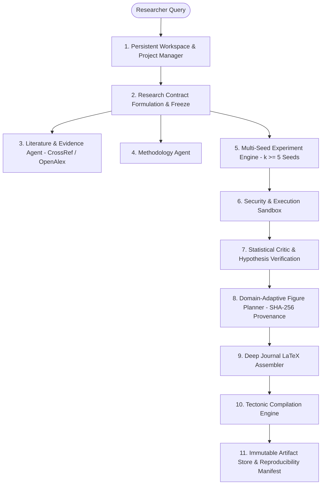

# NovaScientist v2.3 🔬

[](https://github.com/chsushen/novascientist/releases/latest)
[-brightgreen.svg)](tests/)
[]()
[](LICENSE)
[]()

**Evidence-First Autonomous Research Infrastructure for Scientific Investigation & Publication**

NovaScientist is an evidence-first autonomous research infrastructure platform that transforms research questions into rigorously evaluated, empirically grounded, and typeset 8–12 page IEEE Transactions manuscripts with verified DAG provenance.

---

## 🏛️ System Architecture



---

## 🚀 Key Features

- **Frozen Scientific Research Contract**: Strict contract binding datasets, baselines, methods, required experiments, mathematical treatments, statistical tests, figures, and manuscript sections with zero downstream drift.
- **Persistent Workspaces**: Hierarchical `User -> Project -> ResearchRun -> Artifacts/Evidence/Contract/Provenance` storage with complete run inspection, checkpointing, and cross-run comparison.
- **Asynchronous Background Jobs**: Decoupled background task executor supporting progress tracking, cancellation tokens, retries, and structured failure reporting.
- **Immutable Artifact Store**: Cryptographic SHA-256 verified artifact storage for datasets, results, figures, statistics, manuscripts, PDFs, and Overleaf ZIP packages.
- **Production REST API**: Clean FastAPI service layer providing complete endpoints for programmatic integration.
- **Reproducibility Manifest**: Standardized machine-readable descriptor capturing Git commit SHA, environment, hardware signatures, random seeds, and DAG provenance closure.
- **Controlled Security Sandbox**: Defense-in-depth security with path traversal protection, secret leakage scanning, and malicious LaTeX sanitization.

---

## 🛠️ Quickstart

### Using Docker Compose (Recommended)
```bash
git clone https://github.com/chsushen/novascientist.git
cd novascientist
cp .env.example .env
docker compose up --build -d
```
- **REST API Server**: `http://localhost:8000` (Swagger UI at `/docs`)
- **Interactive UI**: `http://localhost:8501`

### Standalone Python Setup
```bash
python3 -m venv .venv
source .venv/bin/activate
pip install -r requirements.txt

# Run the API Server
uvicorn backend.api.server:app --host 0.0.0.0 --port 8000

# Run the Pytest Suite
pytest tests/ -v
```

---

## 📚 Documentation
- [REST API Reference](docs/api.md)
- [Security & Sandboxing](docs/security.md)
- [Deployment Guide](docs/deployment.md)
- [Product Vision & Positioning](docs/product.md)
- [Reproducibility & Manifests](docs/reproducibility.md)
- [Known Limitations](docs/limitations.md)
- [Production MVP Readiness Audit](docs/production_mvp_readiness.md)

---

## ⚖️ Academic Integrity & AI-Assistance Disclosure
NovaScientist conforms strictly with IEEE and ACM 2024+ authorship policies:
- All empirical claims and citations require verified literature evidence or empirical multi-seed telemetry.
- AI tools are disclosed exclusively for pipeline orchestration and formatting assistance; human researcher profiles are required as primary authors.

---

## 📄 License
Licensed under the [Apache License 2.0](LICENSE).
