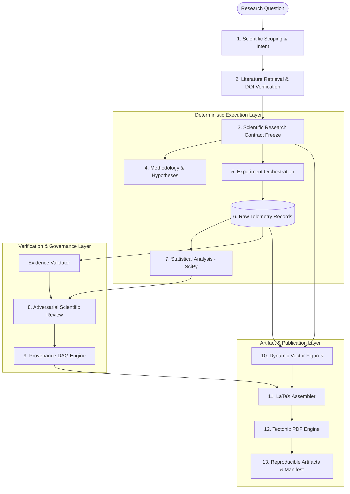

# NovaScientist v2.3.0 — System Architecture & Dataflow

## 1. High-Level Architecture Overview

NovaScientist is an evidence-first autonomous research infrastructure platform. It organizes the lifecycle of computational scientific research into a disciplined, 13-stage pipeline governed by an immutable **Scientific Research Contract**.

```
Research Question
       ↓
Scientific Scoping
       ↓
Evidence / Literature
       ↓
Research Contract (Frozen)
       ↓
Methodology & Hypotheses
       ↓
Experiment Orchestration
       ↓
Raw Telemetry
       ↓
Statistical Analysis (SciPy)
       ↓
Scientific Review (7 Pillars)
       ↓
Provenance DAG
       ↓
Vector Figures
       ↓
LaTeX / Tectonic PDF
       ↓
Reproducible Artifacts
```



---

## 2. Deterministic Software vs. LLM Reasoning Boundaries

NovaScientist strictly separates generative reasoning from deterministic computation:

| Pipeline Stage | Subsystem | Nature | Implementation / Mechanism |
| :--- | :--- | :---: | :--- |
| **Scoping & Planning** | `agentic_planner.py`, `topic_profile.py` | LLM + Deterministic | Topic classification, intent extraction, structural schema validation. |
| **Literature Retrieval** | `literature.py`, `doi_verifier.py` | Deterministic | CrossRef and OpenAlex HTTP APIs, JSON parsing, DOI format regex validation. |
| **Research Contract** | `research_contract.py` | Deterministic | Frozen dataclasses, immutable hashing, fail-closed validation. |
| **Methodology Formalization** | `methodology_agent.py`, `math_agent.py` | LLM + Deterministic | Mathematical formulation generation, type-checked hypothesis specifications. |
| **Experiment Execution** | `real_trainer.py`, `universal_engine.py` | Deterministic | PyTorch / NumPy execution, monotonic timer (`perf_counter`), memory profiling. |
| **Statistical Analysis** | `statistical_critic.py`, `methodology_agent.py` | Deterministic | SciPy (`paired_t_test`, `chi2`, `wilcoxon`), DerSimonian-Laird random effects. |
| **Peer Review** | `scientific_reviewer.py` | LLM + Deterministic | 7-pillar critique prompt evaluated against concrete statistical pass/fail thresholds. |
| **Provenance Tracking** | `provenance.py` | Deterministic | NetworkX Directed Acyclic Graph (DAG), SHA-256 node/edge hashing. |
| **Figure Generation** | `figure_planner.py`, `plotter.py` | Deterministic | Matplotlib vector rendering directly from empirical telemetry arrays. |
| **Typesetting & PDF** | `deep_journal_assembler.py`, `tectonic_runner.py` | Deterministic | Jinja2/LaTeX templating, Tectonic standalone Rust binary compilation, PyPDF audit. |

---

## 3. End-to-End Pipeline Stages

### Stage 1: Scientific Scoping & Intent (`agentic_planner.py`, `topic_profile.py`)
- Analyzes the researcher's query, extracting domain keywords, goals, and constraints.
- Maps input into one of 6 universal computational domains: NLP/RAG, PEFT, Time-Series Forecasting, Graph Neural Networks, Surrogate Modeling, or Physics-Informed NNs.

### Stage 2: Evidence & Literature Grounding (`literature.py`, `doi_verifier.py`)
- Queries external scholarly databases via CrossRef and OpenAlex APIs.
- Extracts passage-grounded claims with source citations.
- Validates DOIs against live resolver formats and filters retracted publications.

### Stage 3: Frozen Research Contract (`research_contract.py`)
- Formalizes a single immutable contract (`ScientificResearchContract.freeze()`).
- Binds dataset names, baseline candidate lists, proposed method names, metric names, statistical tests, figure requirements, and section blueprints.
- Prevents post-freeze mutations (raising `ScientificContractViolationError`).

### Stage 4: Methodology & Hypothesis Formulation (`methodology_agent.py`)
- Generates testable hypotheses with explicit metric directions, thresholds, and comparison targets.
- Formulates loss functions and mathematical treatments.

### Stage 5: Experiment Orchestration (`universal_engine.py`, `real_trainer.py`)
- Launches multi-seed executions ($k \ge 5$) under sandboxed execution limits.
- Collects raw telemetry arrays: loss curves, accuracy, latency, memory consumption, throughput.

### Stage 6: Raw Telemetry & Isolation Guard (`ast_guard.py`)
- Inspects code syntax trees to ensure clean data isolation between training and validation splits.
- Attaches monotonic timestamps and hardware metadata.

### Stage 7: Statistical Analysis & Hypothesis Evaluation (`statistical_critic.py`)
- Evaluates hypotheses against empirical telemetry without fallback constants:
  - **Performance / Gains**: Paired Student's $t$-test or Wilcoxon signed-rank test; Cohen's $d$; 95% Student's $t$ confidence intervals.
  - **Variance Bounds**: Sample standard deviation $s$, Chi-Square test on variance bounds ($\chi^2$), exact $p$-value from $\chi^2$ distribution.
  - **Meta-Analysis**: DerSimonian-Laird random-effects model, Cochran's $Q$, $I^2$ heterogeneity, summary effect size $\theta$, and $Z$-score.

### Stage 8: Adversarial Scientific Review (`scientific_reviewer.py`)
- Multi-perspective evaluation across 7 pillars: Novelty, Methodology, Evidence Grounding, Experimental Rigor, Results Significance, Reproducibility, and Limitations.
- Executes bounded revision loop ($k \le 3$) to refine prose and hedge unsubstantiated claims.

### Stage 9: Cryptographic Provenance DAG (`provenance.py`)
- Constructs an immutable Directed Acyclic Graph connecting every artifact to its origin:
  $$\text{Query} \rightarrow \text{Contract} \rightarrow \text{Source} \rightarrow \text{Claim} \rightarrow \text{Method} \rightarrow \text{Seed Run} \rightarrow \text{Telemetry} \rightarrow \text{Hypothesis} \rightarrow \text{Review} \rightarrow \text{Manuscript}$$
- Validates DAG closure (zero dangling edges, zero orphaned entities).

### Stage 10: Dynamic Vector Figures (`figure_planner.py`, `plotter.py`)
- Generates publication-ready vector figures (Architecture, Loss Convergence, Pareto Trade-offs, Ablation Breakdowns, Metric Distributions) directly from empirical seed logs.

### Stage 11: Deep Journal LaTeX Assembler (`deep_journal_assembler.py`)
- Assembles complete, IEEE Transactions compliant LaTeX source (`main.tex`, `references.bib`).
- Enforces strict page budgeting and includes mandatory AI-assistance ethics disclosures.

### Stage 12: Tectonic PDF Compilation (`tectonic_runner.py`)
- Compiles LaTeX into a standalone PDF via the Tectonic engine.
- Verifies physical page budget (6–8 physical pages for Standard, 8–12 physical pages for Extended Journal) using `pypdf`.

### Stage 13: Reproducible Artifacts & Manifest (`manifest_generator.py`)
- Generates `run_summary.json`, `provenance_graph.json`, `reproducibility_manifest.json`, and Overleaf-ready ZIP bundles.

