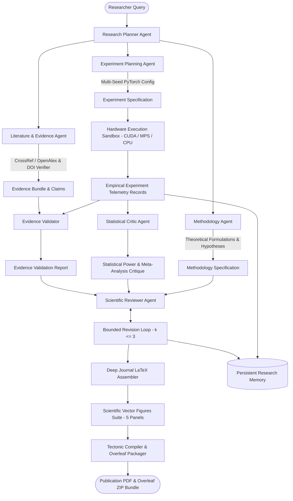

# NovaScientist v2.0 — System Architecture & Component Dataflow

## 1. High-Level Agentic Architecture Overview

NovaScientist v2.0 is an autonomous, multi-agent research-to-publication engine that turns scientific queries into empirically validated, peer-reviewed, and rigorously typeset IEEE Transactions manuscripts.

---

## 2. Core Agentic Subsystems

### 2.1 Research Planner Agent (`backend/core/agentic_planner.py`)
- **Role**: Structures unstructured research queries into typed, scientifically validated `ResearchPlan` objects.
- **Responsibilities**:
  - Domain classification across 6 universal computational domains.
  - Objective formulation, sub-question derivation, and constraint assignment.
  - Automated structural consistency validation (`validate_plan`).

### 2.2 Literature & Evidence Agent (`backend/core/evidence_agent.py` & `backend/core/literature.py`)
- **Role**: Discovers verifiable scholarly sources and extracts passage-grounded claims.
- **Responsibilities**:
  - Live query resolution via CrossRef and OpenAlex APIs with environment-configurable timeouts.
  - Exact text passage extraction (`source_origin`, `text_origin`).
  - Active DOI verification and title/year fuzzy cross-checking via [`DOIVerifier`](../backend/core/doi_verifier.py).
  - Zero-synthetic fallback invariant: if external scholarly APIs fail, returns clean empty evidence sets without fabricating citations.

### 2.3 Methodology Agent (`backend/core/methodology_agent.py`)
- **Role**: Formulates sound theoretical specifications (`MethodologySpec`).
- **Responsibilities**:
  - Explicit delineation of established physical facts, retrieved literature evidence, and proposed innovations.
  - Clear separation of mathematical objectives, loss formulations, and testable empirical hypotheses.

### 2.4 Experiment Planning & Hardware Sandbox (`backend/core/experiment_agent.py` & `backend/core/real_trainer.py`)
- **Role**: Executes multi-seed PyTorch neural optimization runs on local hardware.
- **Responsibilities**:
  - Auto-detection of hardware targets (`NVIDIA GPU (CUDA)`, `Apple Silicon (MPS)`, `Multi-Core CPU`).
  - High-precision monotonic wall-clock timing (`time.perf_counter()`) and UTC ISO-8601 start/end timestamps.
  - Fault-injection trapping and failure propagation (`status = 'failed'` with exact exception).
  - Checkpoint safety: weights attached strictly to completed runs of proposed architectures.

### 2.5 Evidence Validator (`backend/core/evidence_validator.py`)
- **Role**: Bridges external literature claims with observed empirical performance.
- **Responsibilities**:
  - Evaluates claim veracity against actual metric deltas ($\Delta \text{Accuracy}$, memory reduction, latency speedup).
  - Classifies claim support levels: `supported`, `weak`, `unsupported`.
  - Computes `unsupported_rate` for downstream reviewer gating.

### 2.6 Statistical Critic Agent (`backend/core/statistical_critic.py`)
- **Role**: Performs adversarial data-driven statistical audits of experiment telemetry.
- **Responsibilities**:
  - Computes sample size $n$, sample mean $\bar{x}$, standard deviation $s$ ($\text{ddof}=1$), standard error $\text{SE}$, and 95% Student's t confidence intervals.
  - Executes paired Student's t-test or Wilcoxon signed-rank test via `scipy.stats`.
  - Computes Cohen's d effect size and classifies magnitude (`negligible`, `small`, `medium`, `large`).
  - DerSimonian-Laird random-effects meta-analysis: Cochran's Q, $I^2$ heterogeneity, and pooled effect size.
  - Zero-fabrication invariant: single-seed runs trigger explicit underpowered warnings rather than fabricated variance.

### 2.7 Scientific Reviewer & Bounded Revision Loop (`backend/core/scientific_reviewer.py`)
- **Role**: Implements rigorous 7-pillar peer review with self-critique manuscript refactoring.
- **Responsibilities**:
  - Evaluates Novelty, Methodology, Evidence, Experiments, Results, Reproducibility, and Limitations.
  - Ingests `EvidenceValidationReport` and `StatisticalCritique`.
  - Executes bounded revision loop ($k \le 3$ iterations) with targeted manuscript refactoring (hedging hyperbole, injecting limitations, adding determinism sections).

### 2.8 Persistent Research Memory (`backend/core/research_memory.py`)
- **Role**: Preserves cross-session empirical findings and knowledge graphs without database overhead.
- **Responsibilities**:
  - Atomic file-backed JSON persistence (`os.replace` on temporary PID-stamped files with `os.fsync`).
  - Corrupted file recovery with automatic backups (`.corrupted.<timestamp>.bak`).
  - Weighted domain and keyword relevance ranking.
  - Knowledge graph topology export (`Task`, `Domain`, `Method` nodes and relationship edges).

---

## 3. Entity Provenance & Lineage Graph

NovaScientist maintains a strict entity lineage graph (`backend/core/provenance.py`):

$$\text{Question} \longrightarrow \text{Plan} \longrightarrow \text{Source} \longrightarrow \text{Claim} \longrightarrow \text{Methodology} \longrightarrow \text{Experiment} \longrightarrow \text{Result} \longrightarrow \text{Review} \longrightarrow \text{Conclusion}$$

Every claim, empirical finding, and reviewer decision is cryptographically traceable back to its originating node.
